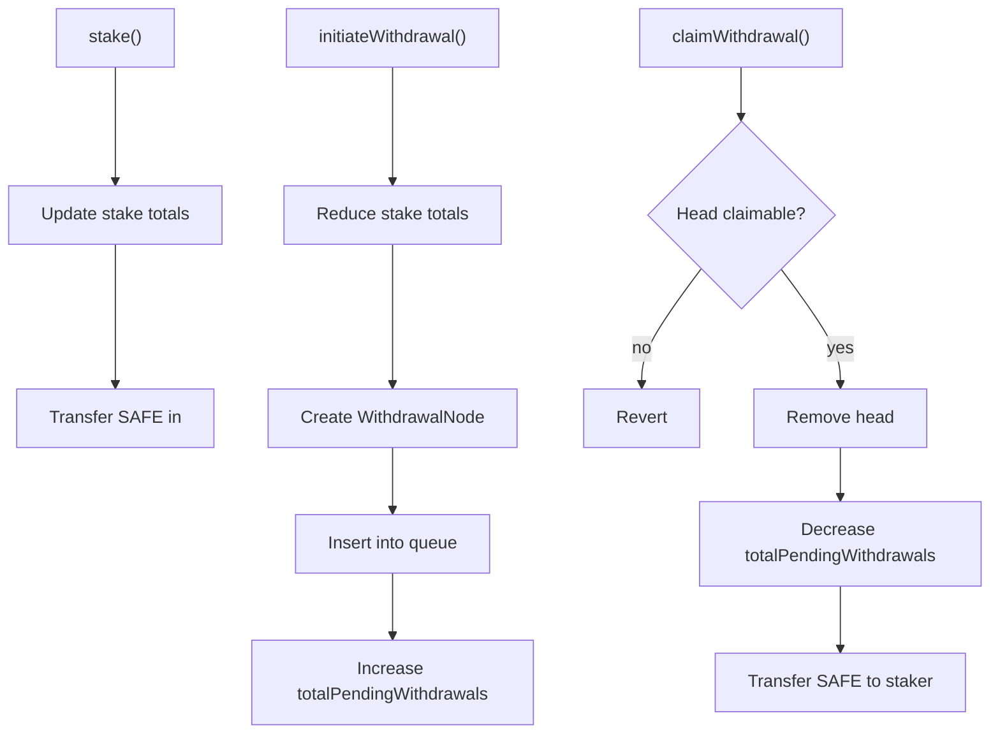

# Staking Contract Documentation

## Overview
The `Staking` contract manages SAFE token deposits tied to validator addresses. It enables:

- Staking SAFE tokens toward registered validators.
- Delayed withdrawals via per-staker-per-validator queues.
- Owner-governed configuration and validator registry changes with a timelock.
- Recovery of unencumbered tokens accidentally sent to the contract.

The contract is non-upgradeable and relies on `Ownable` for admin control. It does not implement rewards, slashing, or validator performance logic; it is a ledger for deposits and delayed withdrawals.

## Architecture Summary
- **Token**: Immutable `SAFE_TOKEN` ERC20.
- **Stake accounting**: Per staker and per validator totals, plus global counters.
- **Withdrawals**: Each staker/validator pair has a doubly linked list sorted by `claimableAt`.
- **Config changes**: Two-step propose/execute with a fixed `CONFIG_TIME_DELAY`.
- **Access control**: `onlyOwner` for proposals and token recovery; execution is permissionless once timelock expires.

## Data Structures

### Structs
- `WithdrawalNode`
  - **Purpose**: Node in a per-staker-per-validator withdrawal queue.
  - **Fields**:
    - `amount`: Withdrawal amount.
    - `claimableAt`: Timestamp when claimable.
    - `previous` / `next`: Linked list pointers (0 is null).
  - **Invariants / edge cases**:
    - Queue is expected to be sorted by `claimableAt` ascending.
    - Linked list pointers must remain consistent; incorrect manual insertion reverts.
    - `claimableAt` is stored as `uint128`; truncation only possible at extreme timestamps.

- `WithdrawalQueue`
  - **Purpose**: Tracks head/tail of a withdrawal list for a staker/validator pair.
  - **Invariants**:
    - `head == 0 && tail == 0` indicates empty queue.
    - `head` and `tail` are withdrawal IDs; `0` is reserved as null.

- `ConfigProposal`
  - **Purpose**: Represents a pending config change (withdraw delay).
  - **Invariants**:
    - `executableAt == 0` means no pending proposal.
    - The proposal can be overwritten by a new proposal.

- `WithdrawalInfo`
  - **Purpose**: View helper for pending withdrawals.

### Storage Variables
- `SAFE_TOKEN` (immutable)
  - **Purpose**: ERC20 token to stake and withdraw.
  - **Security**: Assumed to be the official SAFE Token.

- `CONFIG_TIME_DELAY` (immutable)
  - **Purpose**: Timelock duration for config changes.
  - **Invariant**: `withdrawDelay` must always be `<= CONFIG_TIME_DELAY`.

- `totalStakedAmount`
  - **Purpose**: Global total of active stake.
  - **Invariant**: `totalStakedAmount + totalPendingWithdrawals` should not exceed SAFE balance held.

- `totalPendingWithdrawals`
  - **Purpose**: Sum of amounts in withdrawal queues.
  - **Invariant**: Must track the sum of all withdrawal nodes.

- `withdrawDelay`
  - **Purpose**: Delay in seconds before withdrawals are claimable.
  - **Constraints**: Non-zero and `<= CONFIG_TIME_DELAY`.

- `nextWithdrawalId`
  - **Purpose**: Monotonic ID generator for withdrawals, starting at 1.
  - **Edge case**: Theoretical overflow at `2^64-1` withdrawals.

### Mappings
- `isValidator[validator] -> bool`
  - **Purpose**: Registry of validators eligible for new stakes.
  - **Edge case**: Deregistration does not block withdrawals.

- `totalValidatorStakes[validator] -> uint256`
  - **Purpose**: Total active stake per validator.

- `stakes[staker][validator] -> uint256`
  - **Purpose**: Stake per staker and validator.
  - **Invariant**: Decremented before creating a withdrawal.

- `totalStakerStakes[staker] -> uint256`
  - **Purpose**: Total active stake per staker across validators.

- `withdrawalQueues[staker][validator] -> WithdrawalQueue`
  - **Purpose**: Head/tail pointers for each queue.

- `withdrawalNodes[withdrawalId] -> WithdrawalNode`
  - **Purpose**: Storage of all withdrawal nodes.
  - **Invariant**: A node exists iff `claimableAt != 0` and referenced by a queue.

- `pendingWithdrawDelayChange -> ConfigProposal`
  - **Purpose**: Pending withdraw delay change.

- `pendingValidatorChangeHash -> bytes32`
  - **Purpose**: Hash of a pending validator update proposal.
  - **Edge case**: Only the hash is stored; execution requires supplying matching arrays.

## Events
- `StakeIncreased`: Emitted after stake state is updated and before token transfer.
- `WithdrawalInitiated`: Emitted when a withdrawal node is created.
- `WithdrawalClaimed`: Emitted after queue updates and before token transfer.
- `ValidatorsProposed`: Emitted for validator update proposals; includes arrays and `executableAt`.
- `ValidatorUpdated`: Emitted per validator when a proposal is executed.
- `WithdrawDelayProposed`: Emitted on withdraw delay proposal.
- `WithdrawDelayChanged`: Emitted on execution of withdraw delay change (also emitted in constructor).
- `TokensRecovered`: Emitted before token recovery transfer.

**Event strategy**: Every state-changing external action emits a dedicated event to support off-chain indexing and auditability.

## Errors
Custom errors are used for gas efficiency and precise revert reasons:

- `InvalidAmount`: Zero or invalid amount.
- `InvalidAddress`: Zero address input.
- `NotValidator`: Staking to non-registered validator.
- `InsufficientStake`: Withdraw amount exceeds current stake.
- `ProposalNotSet`, `InvalidProposalHash`, `ProposalNotExecutable`, `NoProposalExists`: Timelock and proposal validation.
- `InsufficientRecoverableAmount`: No recoverable tokens.
- `WithdrawalQueueEmpty`, `NoClaimableWithdrawal`: Withdrawal claim validation.
- `ArrayLengthMismatch`: Validators arrays mismatch.
- `InvalidParameter`: Parameter out of bounds (e.g., withdraw delay).
- `InvalidWithdrawalNode`, `InvalidOrdering`: Manual queue insertion validation.

## External Functions

### Staking Operations
- `stake(validator, amount)`
  - **Purpose**: Increase stake for a validator.
  - **Invariants**: Validator must be registered; amount must be non-zero.
  - **Security**: State updates precede `safeTransferFrom` (reverts roll back state).

- `initiateWithdrawal(validator, amount)`
  - **Purpose**: Create a withdrawal and insert into a sorted queue automatically.
  - **Edge case**: Traverses from tail; long queues may be gas-intensive.
  - **Ordering**: Ensures queue remains sorted by `claimableAt`.

- `initiateWithdrawalAtPosition(validator, amount, previousId)`
  - **Purpose**: Manual insertion for gas optimization.
  - **Security**: Caller must supply correct `previousId` to maintain ordering.
  - **Edge case**: Incorrect ordering or non-existent node reverts.

- `claimWithdrawal(staker, validator)`
  - **Purpose**: Claim the head of the queue once claimable.
  - **Access**: Permissionless; tokens always go to `staker`.
  - **Invariants**: Only head can be claimed; updates queue then transfers.

### Configuration Proposals (Owner Only)
- `proposeWithdrawDelay(newDelay)`
  - **Purpose**: Stage a new withdraw delay.
  - **Constraints**: `newDelay != 0` and `newDelay <= CONFIG_TIME_DELAY`.

- `proposeValidators(validators, isRegistration)`
  - **Purpose**: Stage validator registry changes.
  - **Edge cases**:
    - Duplicate validators are allowed in a proposal.
    - Arrays are hashed with `executableAt`; execution must match exactly.

### Configuration Execution (Public)
- `executeWithdrawDelayChange()`
  - **Purpose**: Apply a pending withdraw delay after timelock.
  - **Invariant**: Proposal must exist and be executable.

- `executeValidatorChanges(validators, isRegistration, executableAt)`
  - **Purpose**: Apply pending validator changes after timelock.
  - **Invariant**: Hash must match the pending proposal and be executable.

### Token Recovery (Owner Only)
- `recoverTokens(token, to)`
  - **Purpose**: Recover tokens sent accidentally.
  - **Security**:
    - For SAFE_TOKEN, only excess over staked + pending is recoverable.
    - For other tokens, full balance is recoverable.

### View Functions
- `getPendingWithdrawals(staker, validator)`
  - **Purpose**: Returns all pending withdrawals in order.
  - **Edge case**: O(n) traversal; intended for off-chain reads.

- `getNextClaimableWithdrawal(staker, validator)`
  - **Purpose**: Returns head of the queue.

## Staking and Withdrawal Process

### Staking
1. Staker calls `stake(validator, amount)`.
2. Contract checks validator is registered and amount is non-zero.
3. Stake accounting is updated.
4. SAFE tokens are transferred in via `safeTransferFrom`.

### Withdrawal Initiation
1. Staker calls `initiateWithdrawal` or `initiateWithdrawalAtPosition`.
2. Contract verifies sufficient stake and reduces stake totals.
3. A withdrawal node is created with `claimableAt = block.timestamp + withdrawDelay`.
4. Node is inserted into the queue (auto-sorted or manual position).
5. `totalPendingWithdrawals` is increased.

### Withdrawal Claim
1. Anyone calls `claimWithdrawal(staker, validator)`.
2. The head node is checked for claimability (`block.timestamp >= claimableAt`).
3. Node is removed from the queue.
4. `totalPendingWithdrawals` is reduced.
5. SAFE tokens are transferred to `staker`.

## Access Control and Upgradeability
- **Access control**: `Ownable` restricts proposal and recovery functions to the owner.
- **Permissionless execution**: `executeWithdrawDelayChange` and `executeValidatorChanges` are public once timelock expires, allowing anyone to execute.
- **Upgradeability**: None. Contract is immutable post-deployment.

## Error Handling and Event Emission
- **Errors**: Custom errors are used for precise, gas-efficient reverts.
- **Events**: Every state-changing action emits a specific event. Proposals and executions are fully signaled to allow off-chain monitoring.

## Key Parameters

| Parameter | Type | Description | Constraints |
| --- | --- | --- | --- |
| `SAFE_TOKEN` | ERC20 | Staking token | Immutable, non-zero |
| `CONFIG_TIME_DELAY` | uint256 | Timelock for config changes | Immutable, non-zero |
| `withdrawDelay` | uint128 | Claim delay for withdrawals | `> 0`, `<= CONFIG_TIME_DELAY` |
| `nextWithdrawalId` | uint64 | Withdrawal ID counter | Starts at 1 |
| `totalStakedAmount` | uint256 | Sum of active stakes | Updated on stake/withdraw |
| `totalPendingWithdrawals` | uint256 | Sum of queued withdrawals | Updated on withdraw/claim |

## Security Assumptions and Risks
- **Token standard**: Assumes `SAFE_TOKEN` behaves like a standard ERC20 (will be official SAFE Token).
- **Queue integrity**: Manual insertion relies on user-supplied ordering; incorrect ordering reverts.
- **Gas griefing**: Automatic queue insertion is O(n); very long queues can make `initiateWithdrawal` costly.
- **Timestamp reliance**: Uses `block.timestamp` for `claimableAt`; minor miner manipulation within allowed consensus bounds.
- **Proposal overwrite**: New proposals overwrite pending ones; no explicit cancellation beyond overwriting.
- **Validator update hash**: Only a hash is stored; correctness depends on matching arrays and `executableAt`.
- **Economic risks**: No slashing/rewards; stake is custodial within the contract. Owner could deregister validators, but this does not block withdrawals.

## Glossary
- **Staker**: Address depositing SAFE tokens.
- **Validator**: Address receiving delegated stake.
- **Withdrawal queue**: Ordered list of withdrawal requests per staker/validator.
- **Claimable**: Withdrawal whose `claimableAt` timestamp has passed.
- **Timelock**: `CONFIG_TIME_DELAY` used to delay config changes.
